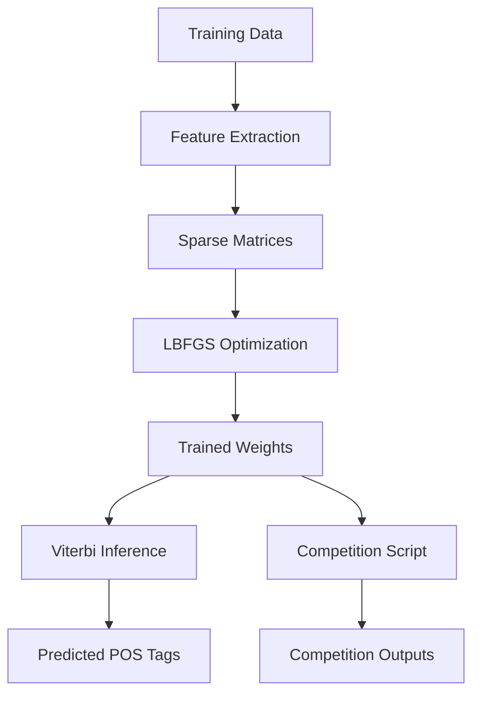

MEMM POS Tagger — Sequence Labeling NLP Project (From Scratch)

A full Maximum Entropy Markov Model (MEMM) POS-tagging system implemented without external NLP libraries.

👋 Overview

This project implements a Maximum Entropy Markov Model (MEMM) for Part-of-Speech (POS) tagging, built entirely from scratch as part of an advanced Natural Language Processing course.

The system includes:

A complete feature-based MEMM

Custom Viterbi inference with beam search & pruning

Sparse-matrix training with L-BFGS optimization

Two trained models:

Model 1 (Large) – 5,000-sentence dataset

Model 2 (Small) – 250-sentence dataset

Reproducible inference for competition datasets

This project demonstrates end-to-end model design, optimization, inference engineering, and error analysis — without relying on ML frameworks.

📘 Assignment Context

This work was created for an upper-level NLP course requiring students to:

Implement all Ratnaparkhi f100–f107 features

Add additional features for robustness

Train two MEMM models under parameter constraints

Build Viterbi inference manually

Perform accuracy-based evaluation

Tag two competition datasets

All code adheres strictly to assignment rules (no NLP libraries, no Viterbi/MEMM implementations, only NumPy/SciPy).

⚙️ Technical Implementation
Feature Engineering

In addition to the required Ratnaparkhi features (f100–f107), I implemented a rich set of linguistically-informed features, including:

Numeric features: contains_digit, is_number

Capitalization: starts_capital, all_caps

Currency patterns: billion_yen, number_before_currency

Directional/temporal cues: up, down, ago

Title & organization cues: chief executive, ministry/agency patterns

Compound noun detection: hyphenation and suffix patterns

3-gram contextual features

These additions significantly reduced errors in common confusion classes such as IN/RB, NN/NNP, and DT/WDT.

Model Training

Training uses L-BFGS with:

Sparse empirical & expected feature counts

L2 regularization

Constraints on total parameter count

Automatic feature pruning

Efficient matrix construction (CSR format)

Model sizes:

Model 1: ~9,984 parameters

Model 2: ~4,625 parameters

Custom Viterbi Inference

The inference engine was developed fully from scratch with several enhancements:

Beam search (top-5 paths) for speed and pruning

Log-space normalization to prevent underflow

Early probability cutoff for low-score paths

Feature caching for fast repeated lookups

Baseline fallback tagger for rare degenerate cases

This results in stable decoding even for long or ambiguous sentences.

🧩 System Architecture (Diagram)
flowchart TD

📊 Models & Results
Model 1 — Large Model

Training data: 5,000 tagged sentences

Parameters: ~9.9K

Accuracy on test set: (insert your accuracy)

Output: comp_m1_212794762.wtag

Performance improved noticeably on:

IN ↔ RB

NN ↔ NNP

"that" (DT/WDT/IN) ambiguity

Currency expressions (yen, dollars)

Model 2 — Small Model

Training data: 250 sentences

Parameters: ~4.6K

Evaluation: 5-fold cross-validation

Average accuracy: ~85–90%

Output: comp_m2_212794762.wtag

Despite limited data, contextual and capitalization features helped stabilize performance.

🏆 Competition Files

The assignment required generating reproducible competition predictions.

The script:

generate_comp_tagged.py

produces:

comp_m1_212794762.wtag

comp_m2_212794762.wtag

These outputs are fully reproducible using the trained .pkl weight files.

🔍 Error Analysis

I implemented a full evaluation suite including:

Confusion matrices

Word-level error breakdowns

Error-context mining

Feature-weight ranking

Frequent error sources included:

IN vs RB

NNP vs NN

Ambiguous nouns vs adjectives

Out-of-vocabulary (OOV) tokens

Engineered features reduced several of these categories significantly.

🚀 How to Run
Model 1
python main.py --mode model1

Model 2
python main.py --mode model2

Train both
python main.py --mode all

Generate competition files
python generate_comp_tagged.py

📦 Requirements

Python 3

numpy

scipy

tqdm

scikit-learn (for cross-validation only)

No external NLP or sequence-model libraries are used.

🧠 Key Takeaways

This project highlights:

End-to-end design of a classical NLP model

Custom feature engineering grounded in linguistic intuition

Implementation of optimization + dynamic programming algorithms

Efficient sparse-matrix computation

Reproducible modeling workflows

It demonstrates both machine learning engineering and deep understanding of NLP fundamentals.
